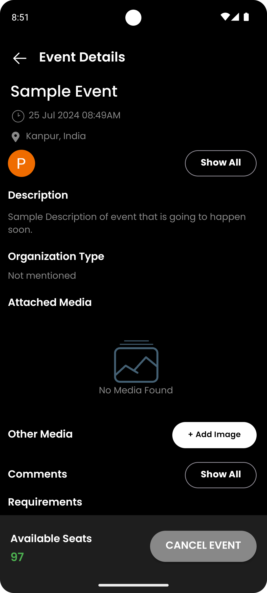

**EventSync - Event Management App**<br>

[Download APK](https://drive.google.com/file/d/1HTxQjPih5pIi234o9WKaa7k__3chGBMP/view?usp=sharing)

## Overview

An app-based platform that allows users to create, search, and delete an event with features like google one tap sign-in, real-time notifications, chat with event collaborators, and comment feature on events.

## App Screenshots In Dark Mode
<p align="center">
  &nbsp;&nbsp;&nbsp;
  &nbsp;&nbsp;&nbsp;
  &nbsp;&nbsp;&nbsp;
  &nbsp;&nbsp;&nbsp;
  &nbsp;&nbsp;&nbsp;
  &nbsp;&nbsp;&nbsp;
  &nbsp;&nbsp;&nbsp;
  &nbsp;&nbsp;&nbsp;
  &nbsp;&nbsp;&nbsp;
  &nbsp;&nbsp;&nbsp;
  &nbsp;&nbsp;&nbsp;
  &nbsp;&nbsp;&nbsp;
  &nbsp;&nbsp;&nbsp;
  &nbsp;&nbsp;&nbsp;
  &nbsp;&nbsp;&nbsp;
  &nbsp;&nbsp;&nbsp;
  &nbsp;&nbsp;&nbsp;
  &nbsp;&nbsp;&nbsp;
  &nbsp;&nbsp;&nbsp;
  &nbsp;&nbsp;&nbsp;
  &nbsp;&nbsp;&nbsp;
  &nbsp;&nbsp;&nbsp;
  &nbsp;&nbsp;&nbsp;
  &nbsp;&nbsp;&nbsp;
  &nbsp;&nbsp;&nbsp;
  &nbsp;&nbsp;&nbsp;
  &nbsp;&nbsp;&nbsp;
  &nbsp;&nbsp;&nbsp;
</p>

## App Screenshots In Light Mode
<p align="center">
  &nbsp;&nbsp;&nbsp;
  &nbsp;&nbsp;&nbsp;
  &nbsp;&nbsp;&nbsp;
  &nbsp;&nbsp;&nbsp;
  &nbsp;&nbsp;&nbsp;
  &nbsp;&nbsp;&nbsp;
  &nbsp;&nbsp;&nbsp;
  &nbsp;&nbsp;&nbsp;
  &nbsp;&nbsp;&nbsp;
  &nbsp;&nbsp;&nbsp;
  &nbsp;&nbsp;&nbsp;
  &nbsp;&nbsp;&nbsp;
  &nbsp;&nbsp;&nbsp;
  &nbsp;&nbsp;&nbsp;
  &nbsp;&nbsp;&nbsp;
  &nbsp;&nbsp;&nbsp;
  &nbsp;&nbsp;&nbsp;
  &nbsp;&nbsp;&nbsp;
  &nbsp;&nbsp;&nbsp;
  &nbsp;&nbsp;&nbsp;
  &nbsp;&nbsp;&nbsp;
  &nbsp;&nbsp;&nbsp;
  &nbsp;&nbsp;&nbsp;
  &nbsp;&nbsp;&nbsp;
  &nbsp;&nbsp;&nbsp;
  &nbsp;&nbsp;&nbsp;
  &nbsp;&nbsp;&nbsp;
  &nbsp;&nbsp;&nbsp;
  &nbsp;&nbsp;&nbsp;
  &nbsp;&nbsp;&nbsp;
</p>


## Features

### Google One Tap Sign-In
- User can sign in or sign up easily in the app with Google One Tap Sign-In.

### Sign In Through Email and Password
- Traditional sign-in option using email and password for user convenience.

### Forget Password
- Easily reset your password if you forget it.

### Create Event
- Effortlessly create new events with detailed descriptions.

### Add Photos in the Event
- Enhance your events by adding photos.

### Repeat Event Feature
- Schedule recurring events with ease.

### Real-Time Notification Using FCM
- Receive real-time notifications for updates and reminders.

### Chatting with Collaborators
- Communicate instantly with collaborators within the app.

### Friend Request Accept System
- Send and accept friend requests to expand your network.

### Searching Event Through Calendar View
- Browse and locate events easily using the calendar view.

### Searching Event Through Name
- Quickly find events by searching with their names.

### Dark Mode and Light Mode
- Toggle between dark mode and light mode to suit your preferences.

### Edit Profile
- Update your personal information and preferences in your profile.

### Handling Loading/Error/Empty States

The app handles loading, error, and empty states for all cases to ensure a smooth user experience.

### Folder Structure

The app follows a standard, well-defined folder structure to maintain clean and maintainable code.

## Third Party Library Used
- Lottie Files
- Glide
- Retrofit

## Getting Started

### Prerequisites
- Android Studio
- An Android device or emulator running Android 5.0 (Lollipop) or higher

### Installation

1. Clone the repository:
    ```bash
    git clone https://github.com/phinion8/StockInfo
    ```

2. Open the project in Android Studio.

3. Build and run the app on your device or emulator.


